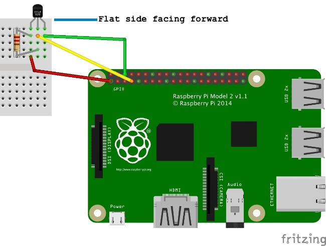

# Enabling 1-wire (background, It's been done for you)
To enable the 1-wire module and drivers, you would need to add a dtoverlay=w1-gpio line to the /boot/config.txt file of the default raspbian image. This has already been done for you on the image you have:

	root@raspberrypi:/media/github/rpi_DS18B20# tail /boot/config.txt 
	# Uncomment some or all of these to enable the optional hardware interfaces
	#dtparam=i2c_arm=on
	#dtparam=i2s=on
	#dtparam=spi=on
	
	# Uncomment this to enable the lirc-rpi module
	#dtoverlay=lirc-rpi
	
	# Additional overlays and parameters are documented /boot/overlays/README
	dtoverlay=w1-gpio

# Wiring setup

Before wiring up the sensor, you should power down the RaspberryPi to avoid shorting out the board. Touching the wrong pins can cause the board to reboot, or damage it. Believe me, I have had both happen.

The following wiring illustration shows how to position the temperature sensor on the breadboard, and connect it to the RaspberryPi GPIO header pins. The connections are:

* Red wire goes from the 3V header pin to the rightmost leg of the temperature sensor
* Yellow wire goes from the GPIO#4 pin to the center leg of the temperature sensor
* Green wire goes from the GND header pin leftmost leg of the temperature sensor
* Place a 4.7k pull up resistor from the row with the read 3v wire to the row with the yellow GPIO#4 wire. This ensures the GPIO#4 pin does not float when there is no sensor output.

The following two photos show a more detailed view of an actual breadboard wired up:

* [WiringPhoto1](./images/tempWiring1.jpg)
* [WiringPhoto2](./images/tempWiring2.jpg)

Once you have the board wired up, power up your RaspberryPi and connect to it to validate that the sensor is recognized.

<!--
https://www.dropbox.com/s/vh05s40x4kfz4hq/2015-05-11%2018.10.49.jpg?dl=0
https://www.dropbox.com/s/dgakxjkv7nc62bk/2015-05-11%2018.11.00.jpg?dl=0
-->

# Look for your device
To test that your temperature sensor is wired correctly and recognized on the 1-wire bus, check for a mapping under the /sys/bus/w1/devices/ directory by listing it's contents. There should be file name of the form 28-0xxxxxxxxxxx under the /sys/bus/w1/devices/ directory, for example:

	root@raspberrypi:/rpi_DS18B20# ls /sys/bus/w1/devices/
	28-0414505a09ff  w1_bus_master1

This shows that the 28-0414505a09ff is the identifier of the temp sensor.
The temperature reading is available from the /sys/bus/w1/devices/28-*/w1_slave file contents. Run the cat command on the file mapping for your temperature sensor. This is what I got:

	cat /sys/bus/w1/devices/28-0414505a09ff/w1_slave
	root@raspberrypi:/rpi_DS18B20# cat /sys/bus/w1/devices/28-0414505a09ff/w1_slave 
	54 01 55 00 7f ff 0c 10 c0 : crc=c0 YES
	54 01 55 00 7f ff 0c 10 c0 t=21250

The file consists of two lines, each containing the hexadecimal register-dump of the sensor IC. At the end of the first line is the checksum (CRC) and whether it is a valid reading, indicated by YES. The second line ends with the temperature reading in 1000x degrees Celsius. This example reading shows a temperature of 21.250 Celsius.

Now that the temperature sensor is working, we can access the sensor from your favorite programming language(s).

# python usage
To access the temperature using a python client, run:

	python ds18b20_read.py

This reads the temperature from the /sys/bus/w1/devices/28-*/w1_slave file contents, and then converts the temperature to Celsius and Farenheit.

*TODO: mqtt example*

# node usage
To access the temperature using a nodejs client, you would first install the ds18b20 module(this has been done for you, see node_modules/ds18b20/) and then run:

	node ds18b20_read.js

To read the temperature in a loop run the ds18b20_poll.js version:

	node ds18b20_poll.js

To read the temperature in a loop and publish the data as a json message to an MQTT broker run the ds18b20_poll_mqtt.js version:

	node ds18b20_poll_mqtt.js

# Java usage
To access the temperature using a Java client, you can use the Gradle script and run:

	gradle readTemp
	
To read the temperature in a loop run the readTempLoop target:

	gradle readTempLoop

To read the temperature in a loop and publish the data as a json message to an MQTT broker run the readTempLoopMQTT target:

	gradle readTempLoopMQTT
	

