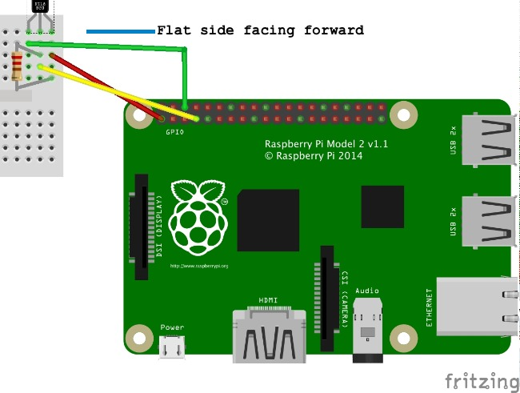

# Enabling 1-wire (background, It's been done for you)
To enable the 1-wire module and drivers, you would need to add a dtoverlay=w1-gpio line to the /boot/config.txt file of the default raspbian image. This has already been done for you on the image you have:

	root@raspberrypi:/media/github/rpi_DS18B20# tail /boot/config.txt 
	# Uncomment some or all of these to enable the optional hardware interfaces
	#dtparam=i2c_arm=on
	#dtparam=i2s=on
	#dtparam=spi=on
	
	# Uncomment this to enable the lirc-rpi module
	#dtoverlay=lirc-rpi
	
	# Additional overlays and parameters are documented /boot/overlays/README
	dtoverlay=w1-gpio

# Wiring setup

Before wiring up the sensor, you should power down the RaspberryPi to avoid shorting out the board. Touching the wrong pins can cause the board to reboot, or damage it. Believe me, I have had both happen.

The following wiring illustration shows how to position the temperature sensor on the breadboard, and connect it to the RaspberryPi GPIO header pins. The connections are:

* Red wire goes from the 3V header pin to the rightmost leg of the temperature sensor
* Yellow wire goes from the GPIO#4 pin to the center leg of the temperature sensor
* Green wire goes from the GND header pin leftmost leg of the temperature sensor
* Place a 4.7k pull up resistor from the row with the read 3v wire to the row with the yellow GPIO#4 wire. This ensures the GPIO#4 pin does not float when there is no sensor output.

The following two photos show a more detailed view of an actual breadboard wired up:

* [WiringPhoto1](./images/tempWiring1.jpg)
* [WiringPhoto2](./images/tempWiring2.jpg)

Once you have the board wired up, power up your RaspberryPi and connect to it to validate that the sensor is recognized.

<!--
https://www.dropbox.com/s/vh05s40x4kfz4hq/2015-05-11%2018.10.49.jpg?dl=0
https://www.dropbox.com/s/dgakxjkv7nc62bk/2015-05-11%2018.11.00.jpg?dl=0
-->

# Look for your device
To test that your temperature sensor is wired correctly and recognized on the 1-wire bus, check for a mapping under the /sys/bus/w1/devices/ directory by listing it's contents. There should be file name of the form 28-0xxxxxxxxxxx under the /sys/bus/w1/devices/ directory, for example:

	root@raspberrypi:/rpi_DS18B20# ls /sys/bus/w1/devices/
	28-0414505a09ff  w1_bus_master1

This shows that the 28-0414505a09ff is the identifier of the temp sensor.
The temperature reading is available from the /sys/bus/w1/devices/28-*/w1_slave file contents. Run the cat command on the file mapping for your temperature sensor. This is what I got:

	cat /sys/bus/w1/devices/28-0414505a09ff/w1_slave
	root@raspberrypi:/rpi_DS18B20# cat /sys/bus/w1/devices/28-0414505a09ff/w1_slave 
	54 01 55 00 7f ff 0c 10 c0 : crc=c0 YES
	54 01 55 00 7f ff 0c 10 c0 t=21250

The file consists of two lines, each containing the hexadecimal register-dump of the sensor IC. At the end of the first line is the checksum (CRC) and whether it is a valid reading, indicated by YES. The second line ends with the temperature reading in 1000x degrees Celsius. This example reading shows a temperature of 21.250 Celsius.

Now that the temperature sensor is working, we can access the sensor from your favorite programming language(s).

# python usage
To access the temperature using a python client, run:

	python ds18b20_read.py

This reads the temperature from the /sys/bus/w1/devices/28-*/w1_slave file contents, and then converts the temperature to Celsius and Farenheit.

A variation of the read loop that publishes the data as a json message to an mqtt broker is found in the ds18b20_read_mqtt.py program. To see it in action, you should have two consoles open, and run the temperature publisher in one using:

	python ds18b20_read_mqtt.py
	
while the mqtt subscriber is run in the other user:

	python mqtt_read.py

The output you see in the two consoles would look something like:

	root@raspberrypi:/rpi_DS18B20# python tst.py 
	publishing to: RHSummit2015_temp_rpi_DS18B20/28-0115162b8cff
	{'sensorid':'28-0115162b8cff', 'temp':25.19, 'time': 1434082515.297409}
	{'sensorid':'28-0115162b8cff', 'temp':25.19, 'time': 1434082517.127406}
	{'sensorid':'28-0115162b8cff', 'temp':25.19, 'time': 1434082518.947288}
	{'sensorid':'28-0115162b8cff', 'temp':25.19, 'time': 1434082520.767277}
	{'sensorid':'28-0115162b8cff', 'temp':25.19, 'time': 1434082522.587313}
	{'sensorid':'28-0115162b8cff', 'temp':25.19, 'time': 1434082524.407261}
	{'sensorid':'28-0115162b8cff', 'temp':25.19, 'time': 1434082526.227258}
	{'sensorid':'28-0115162b8cff', 'temp':25.19, 'time': 1434082528.047264}
	{'sensorid':'28-0115162b8cff', 'temp':25.19, 'time': 1434082529.867282}
	{'sensorid':'28-0115162b8cff', 'temp':25.19, 'time': 1434082531.687271}
	{'sensorid':'28-0115162b8cff', 'temp':25.19, 'time': 1434082533.507255}
	{'sensorid':'28-0115162b8cff', 'temp':25.19, 'time': 1434082535.327279}

	root@raspberrypi:/rpi_DS18B20# python mqtt_read.py 
	Connected with result code 0
	RHSummit2015_temp_rpi_DS18B20/28-0115162b8cff {'sensorid':'28-0115162b8cff', 'temp':25.19, 'time': 1434083262.407352}
	RHSummit2015_temp_rpi_DS18B20/28-0115162b8cff {'sensorid':'28-0115162b8cff', 'temp':25.19, 'time': 1434083264.237310}
	RHSummit2015_temp_rpi_DS18B20/28-0115162b8cff {'sensorid':'28-0115162b8cff', 'temp':25.19, 'time': 1434083266.067311}
	RHSummit2015_temp_rpi_DS18B20/28-0115162b8cff {'sensorid':'28-0115162b8cff', 'temp':25.19, 'time': 1434083267.897309}
	RHSummit2015_temp_rpi_DS18B20/28-0115162b8cff {'sensorid':'28-0115162b8cff', 'temp':25.19, 'time': 1434083269.727321}
	RHSummit2015_temp_rpi_DS18B20/28-0115162b8cff {'sensorid':'28-0115162b8cff', 'temp':25.19, 'time': 1434083271.557307}
	RHSummit2015_temp_rpi_DS18B20/28-0115162b8cff {'sensorid':'28-0115162b8cff', 'temp':25.19, 'time': 1434083273.387295}
	RHSummit2015_temp_rpi_DS18B20/28-0115162b8cff {'sensorid':'28-0115162b8cff', 'temp':25.19, 'time': 1434083275.217404}
	RHSummit2015_temp_rpi_DS18B20/28-0115162b8cff {'sensorid':'28-0115162b8cff', 'temp':25.19, 'time': 1434083277.047355}
	RHSummit2015_temp_rpi_DS18B20/28-0115162b8cff {'sensorid':'28-0115162b8cff', 'temp':25.25, 'time': 1434083278.877329}

# node usage
To access the temperature using a nodejs client, you would first install the ds18b20 module(this has been done for you, see node_modules/ds18b20/) and then run:

	node ds18b20_read.js

To read the temperature in a loop run the ds18b20_poll.js version:

	node ds18b20_poll.js

The output will be like:

	root@raspberrypi:~/Labs/rpi_DS18B20# node ds18b20_read.js
	Getting temperature of: 28-0115162b8cff
	Current temperature is 25.3125

To read the temperature in a loop and publish the data as a json message to an MQTT broker run the ds18b20_poll_mqtt.js version:

	node ds18b20_poll_mqtt.js

# Java usage
To access the temperature using a Java client, you can use the Gradle script and run:

	gradle readTemp

The output will be something like:

	root@raspberrypi:~/Labs/rpi_DS18B20# gradle readTemp
	Starting a new Gradle Daemon for this build (subsequent builds will be faster).
	:compileJava UP-TO-DATE
	:processResources UP-TO-DATE
	:classes UP-TO-DATE
	:readTemp
	/usr/lib/jvm/jdk-8-oracle-arm-vfp-hflt/bin/java -XX:+HeapDumpOnOutOfMemoryError -Dfile.encoding=UTF-8 -Duser.country=GB -Duser.language=en -Duser.variant -cp /root/Labs/rpi_DS18B20/build/classes/main:/root/Labs/rpi_DS18B20/build/resources/main:/root/.gradle/caches/modules-2/files-2.1/org.eclipse.paho/org.eclipse.paho.client.mqttv3/1.0.2/11752d3f24d1a9deda4533a7ca18d8496417ceeb/org.eclipse.paho.client.mqttv3-1.0.2.jar:/root/.gradle/caches/modules-2/files-2.1/com.pi4j/pi4j-core/1.0/b479fd891a87ab398c1d9abef19de95dc8037d9/pi4j-core-1.0.jar:/root/.gradle/caches/modules-2/files-2.1/com.pi4j/pi4j-device/1.0/a6f2229d4f6f7201a839720c948eb64e2178b3b3/pi4j-device-1.0.jar:/root/.gradle/caches/modules-2/files-2.1/com.pi4j/pi4j-gpio-extension/1.0/8a9b6a3ee2be95f5848a2f4e2d876e9284e649d8/pi4j-gpio-extension-1.0.jar org.jboss.summit2015.ds18b20.ReadTemperature 
	Output:
	
	#0: 25.38C or 77.68F
	
	BUILD SUCCESSFUL
	
	Total time: 42.404 secs
	root@raspberrypi:~/Labs/rpi_DS18B20# 

Note the that the first time gradle runs it can be slow, and it starts a daemon for caching so that subsequent runs of the task will be faster. You can copy the java command line shown in the output and run that instead if you not making changes as this will also run much faster.

To read the temperature in a loop run the readTempLoop target:

	gradle readTempLoop
	
This will read up to 100 values:

	root@raspberrypi:~/Labs/rpi_DS18B20# gradle readTempLoop
	:compileJava UP-TO-DATE
	:processResources UP-TO-DATE
	:classes UP-TO-DATE
	:readTempLoop
	/usr/lib/jvm/jdk-8-oracle-arm-vfp-hflt/bin/java -XX:+HeapDumpOnOutOfMemoryError -Dfile.encoding=UTF-8 -Duser.country=GB -Duser.language=en -Duser.variant -cp /root/Labs/rpi_DS18B20/build/classes/main:/root/Labs/rpi_DS18B20/build/resources/main:/root/.gradle/caches/modules-2/files-2.1/org.eclipse.paho/org.eclipse.paho.client.mqttv3/1.0.2/11752d3f24d1a9deda4533a7ca18d8496417ceeb/org.eclipse.paho.client.mqttv3-1.0.2.jar:/root/.gradle/caches/modules-2/files-2.1/com.pi4j/pi4j-core/1.0/b479fd891a87ab398c1d9abef19de95dc8037d9/pi4j-core-1.0.jar:/root/.gradle/caches/modules-2/files-2.1/com.pi4j/pi4j-device/1.0/a6f2229d4f6f7201a839720c948eb64e2178b3b3/pi4j-device-1.0.jar:/root/.gradle/caches/modules-2/files-2.1/com.pi4j/pi4j-gpio-extension/1.0/8a9b6a3ee2be95f5848a2f4e2d876e9284e649d8/pi4j-gpio-extension-1.0.jar org.jboss.summit2015.ds18b20.ReadTemperature 100 
	Output:
	
	#0: 25.38C or 77.68F
	#1: 25.44C or 77.79F
	#2: 25.44C or 77.79F
	#3: 25.44C or 77.79F
	#4: 25.44C or 77.79F
	#5: 25.44C or 77.79F
	#6: 25.44C or 77.79F
	#7: 25.44C or 77.79F
	#8: 25.44C or 77.79F
	#9: 25.44C or 77.79F
	#10: 25.50C or 77.90F
	...
	#90: 25.56C or 78.01F
	#91: 25.56C or 78.01F
	#92: 25.56C or 78.01F
	#93: 25.56C or 78.01F
	#94: 25.56C or 78.01F
	#95: 25.56C or 78.01F
	#96: 25.56C or 78.01F
	#97: 25.56C or 78.01F
	#98: 25.56C or 78.01F
	#99: 25.56C or 78.01F
	
	BUILD SUCCESSFUL
	
	Total time: 3 mins 12.578 secs

To read the temperature in a loop and publish the data as a json message to an MQTT broker run the readTempLoopMQTT target:

	gradle readTempLoopMQTT
	
You can see the temperature readings as they are published by running the readMQTT task in a separate console, or even better, you laptop to verifying the readings are getting off of the RaspberryPi.

	gradle readMQTT
	
	

